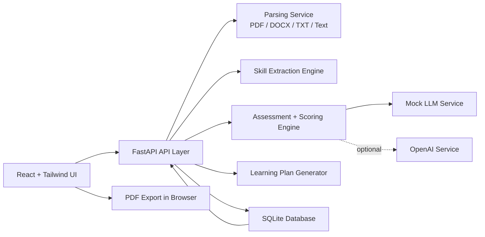
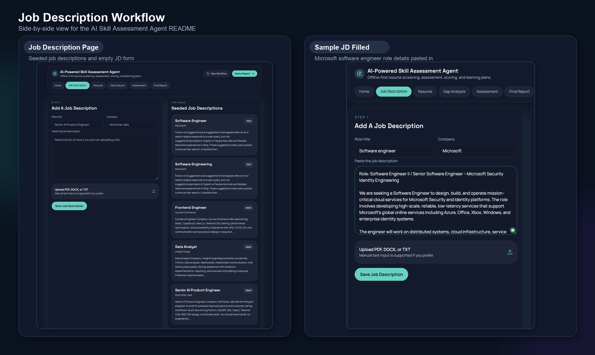

# AI-Powered Skill Assessment & Personalised Learning Plan Agent

An offline-first full-stack hackathon prototype that compares a job description against a candidate resume, generates an explainable skill gap analysis, runs a conversational assessment, scores proficiency, and creates a personalised learning plan with resource links and estimated time.

## What It Does

- Upload or paste a job description
- Upload or paste a resume in `PDF`, `DOCX`, or `TXT`
- Extract required skills from the JD
- Extract claimed skills from the resume
- Compare overlap and missing skills
- Generate assessment questions for important skills
- Score candidate answers with explainable logic
- Compute final skill proficiency using:

```text
Final Skill Score = 40% Resume Match + 60% Assessment Score
```

- Prioritise skill gaps
- Generate a personalised learning plan with curated resources and estimated hours
- Export the final report as PDF from the frontend

## Tech Stack

- Backend: `FastAPI`, `SQLAlchemy`, `SQLite`
- Frontend: `React`, `Vite`, `Tailwind CSS`, `TypeScript`
- Storage: `SQLite`
- AI layer: Offline mock LLM by default, optional OpenAI-backed implementation via `.env`

## Architecture



## Main Pages

1. Home
2. Upload/Input Job Description
3. Upload/Input Resume
4. Skill Gap Analysis
5. Conversational Assessment
6. Final Report

## Screenshots



## Demo-Ready Seed Data

The backend seeds:

- 3 job descriptions
- 3 resumes
- 1 fully completed demo session

Seeded roles include:

- `Senior AI Product Engineer`
- `Data Analyst`
- `Frontend Engineer`

The fastest demo path is opening `Seeded Demo Session` from the home page.

## Project Structure

```text
ai-skill-assessment-agent/
├── backend/
│   ├── app/
│   │   ├── api/
│   │   ├── core/
│   │   ├── db/
│   │   ├── models/
│   │   ├── schemas/
│   │   ├── services/
│   │   └── utils/
│   ├── .env
│   ├── .env.example
│   └── requirements.txt
├── frontend/
│   ├── src/
│   │   ├── components/
│   │   ├── lib/
│   │   ├── pages/
│   │   └── types/
│   ├── .env
│   ├── .env.example
│   └── package.json
├── architecture.md
├── scoring_logic.md
├── demo_script.md
├── sample_job_description.txt
├── sample_resume.txt
└── Makefile
```

## Local Setup

### Backend setup

```bash
cd "/Users/harshithkumarmv/Desktop/ai-skill-assessment-agent/backend"
python3.11 -m venv .venv
source .venv/bin/activate
pip install -r requirements.txt
uvicorn app.main:app --reload
```

Backend runs at:

- API: [http://localhost:8000/api](http://localhost:8000/api)
- Swagger docs: [http://localhost:8000/docs](http://localhost:8000/docs)

### Frontend setup

```bash
cd "/Users/harshithkumarmv/Desktop/ai-skill-assessment-agent/frontend"
npm install
npm run dev
```

Frontend runs at:

- App: [http://localhost:5173](http://localhost:5173)

## Windows Quick Start

If you share this project with a Windows user:

1. Zip the full project folder
2. Send the zip file
3. Ask them to extract it anywhere, for example on the Desktop
4. Ask them to install:
   - Python `3.11+`
   - Node.js `LTS`
5. Then they can run:

```bat
start_demo_windows.bat
```

This launcher:

- creates the backend virtual environment if needed
- installs backend dependencies
- installs frontend dependencies if needed
- starts backend and frontend in separate windows
- opens the browser automatically

Windows launcher file:

- [start_demo_windows.bat](./start_demo_windows.bat)

### Database setup

No manual migration step is required for the prototype.

On backend startup:

- SQLite database file `backend/skill_assessment.db` is created automatically
- tables are created automatically
- seed data is inserted automatically on first boot

## Environment Variables

### Backend `.env`

Important keys:

- `DATABASE_URL`
- `ENABLE_OPENAI`
- `OPENAI_API_KEY`
- `OPENAI_MODEL`
- `MAX_ASSESSMENT_SKILLS`
- `QUESTIONS_PER_SKILL`

Default local `.env` is already included and runs without an API key.

### Frontend `.env`

- `VITE_API_BASE_URL`

Default local `.env` is already included and points to `http://localhost:8000/api`.

## API Summary

### Core endpoints

- `GET /api/health`
- `GET /api/catalog`
- `GET /api/sessions`
- `GET /api/sessions/{session_id}`
- `GET /api/sessions/{session_id}/report`
- `POST /api/job-descriptions`
- `POST /api/resumes`
- `POST /api/sessions/analyze`
- `POST /api/sessions/{session_id}/questions/generate`
- `GET /api/sessions/{session_id}/questions`
- `POST /api/sessions/{session_id}/answers`

### API docs

Use FastAPI Swagger UI:

- [http://localhost:8000/docs](http://localhost:8000/docs)

## Scoring Model

### Resume Match Score

- Derived from detected resume evidence for required JD skills
- Weighted by skill importance extracted from the job description

### Assessment Score

- Derived from the candidate's answer quality
- Rewards:
  - technical depth
  - implementation detail
  - measurable outcomes
  - clear structure

### Final Skill Score

```text
Final Skill Score = 40% Resume Match + 60% Assessment Score
```

### Gap Priority

Gap priority increases when:

- the skill is highly important in the JD
- the final skill score is low

See [scoring_logic.md](./scoring_logic.md) for the full breakdown.

## Sample Inputs

- [sample_job_description.txt](./sample_job_description.txt)
- [sample_resume.txt](./sample_resume.txt)

## Sample Output Shape

Final report includes:

- Skill match percentage
- Assessment score
- Final readiness score
- Skill-by-skill proficiency
- Matching and missing skills
- Priority gaps
- Personalised learning plan
- Resource links
- Estimated time to improve

## Notes

- The app works fully without OpenAI credentials.
- The OpenAI integration is optional and isolated behind a replaceable service layer.
- PDF export is handled client-side from the final report page for demo convenience.
- The UI is intentionally styled for a hackathon demo rather than enterprise admin defaults.
