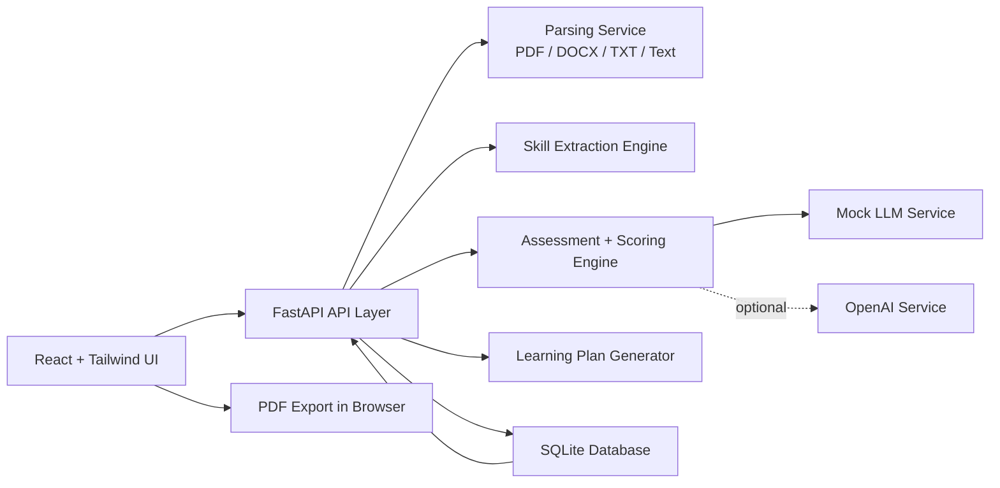
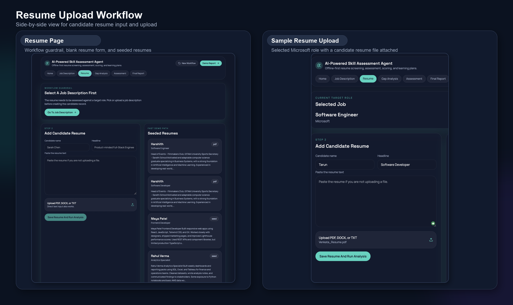
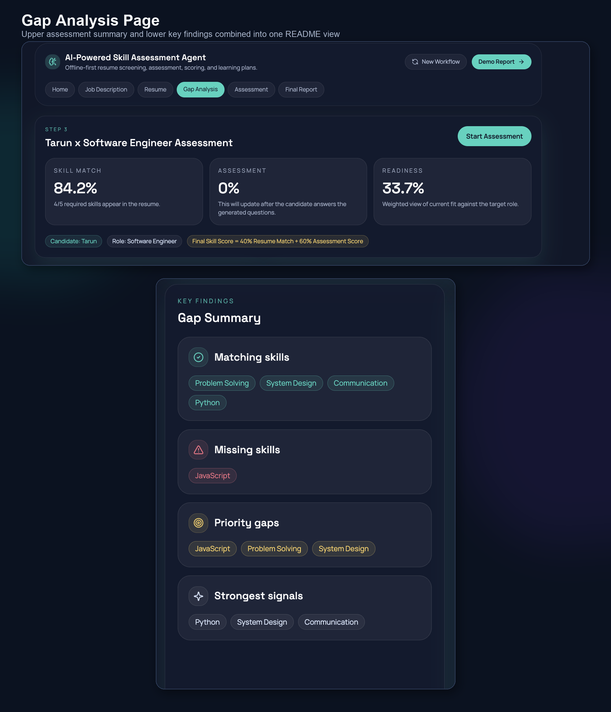
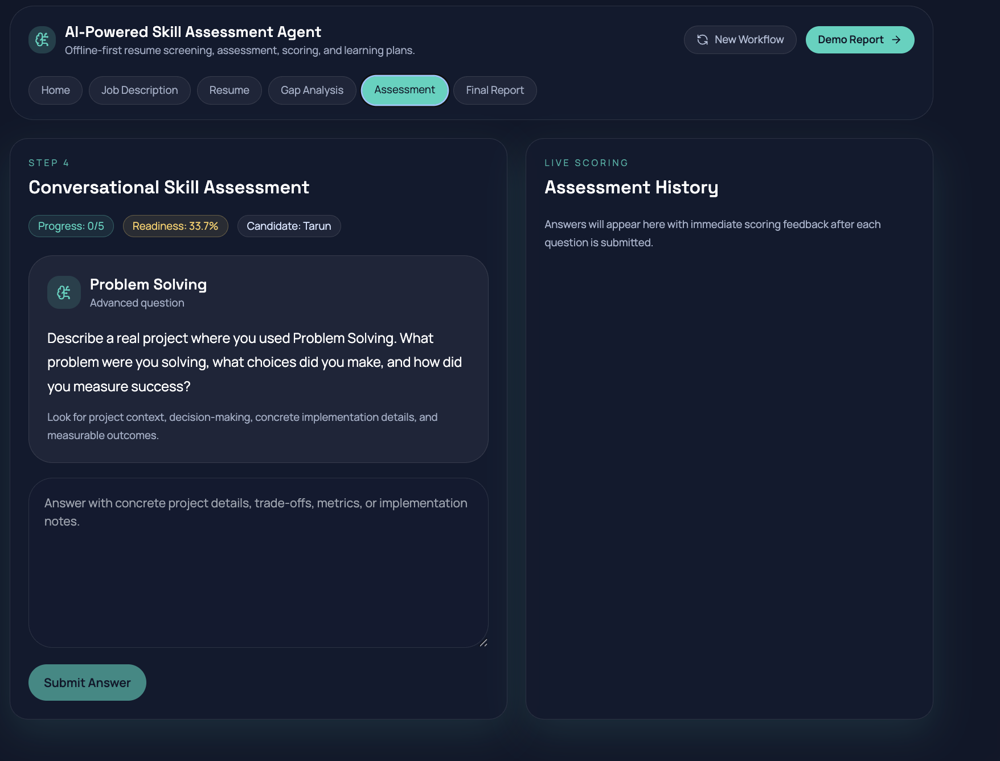
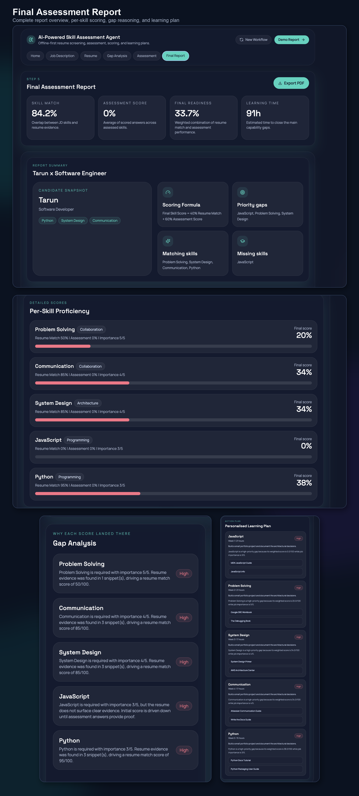

# AI-Powered Skill Assessment & Personalized Learning Plan Agent


A full-stack AI skill assessment platform that compares a job description against a candidate resume, identifies skill gaps, generates assessment questions, scores candidate proficiency, and creates a personalized learning plan.

This project is designed as an **AI Portfolio project** demonstrating resume analysis, skill extraction, explainable scoring, assessment generation, and full-stack AI application development using **FastAPI, React, TypeScript, SQLite, and an offline-first AI workflow**.

---

## Problem Statement

Candidates often struggle to understand how well their resume matches a job description and which skills they need to improve before applying. Manual resume review and skill-gap analysis can be time-consuming, inconsistent, and difficult to personalize.

This project solves that problem by providing an AI-powered workflow that:

- Compares a resume against a target job description
- Extracts matching and missing skills
- Generates assessment questions for important skills
- Scores candidate answers using explainable logic
- Calculates readiness and skill proficiency
- Creates a personalized learning plan with estimated improvement time

---

## Project Overview

The **AI-Powered Skill Assessment & Personalized Learning Plan Agent** is an offline-first full-stack prototype built for hackathon/demo use.

The application allows users to upload or paste a job description and resume, analyzes skill alignment, generates a conversational assessment, evaluates answers, and produces a final readiness report.


---

## What It Does

- Upload or paste a job description
- Upload or paste a resume in `PDF`, `DOCX`, or `TXT`
- Extract required skills from the job description
- Extract claimed skills from the resume
- Compare matching and missing skills
- Generate assessment questions for key skill gaps
- Score candidate answers using explainable scoring logic
- Compute skill proficiency using resume evidence and assessment performance
- Prioritize skill gaps
- Generate a personalized learning plan
- Provide estimated learning time and curated resource links
- Export the final report as a PDF from the frontend

---

## Key Features

- Resume and job description parsing
- Skill extraction from unstructured text
- Skill gap analysis
- Conversational assessment workflow
- Explainable answer scoring
- Final readiness score calculation
- Personalized learning plan generation
- Seeded demo sessions for quick walkthrough
- Offline-first AI workflow
- Optional OpenAI-backed service layer
- PDF report export from frontend
- Full-stack architecture with FastAPI and React

---

## Tech Stack

| Layer | Technology |
|---|---|
| Backend | FastAPI, SQLAlchemy, Pydantic |
| Frontend | React, Vite, TypeScript, Tailwind CSS |
| Database | SQLite |
| Parsing | PDF, DOCX, TXT, Plain Text |
| AI Layer | Offline Mock LLM, Optional OpenAI Integration |
| Reporting | Browser-based PDF Export |
| Runtime | Python 3.11, Node.js LTS |

---

## Recommended Python Version

This project is tested with:

```text
Python 3.11
```

Using Python 3.11 is recommended for smooth backend setup and dependency compatibility.

---

## Key AI/ML Concepts Demonstrated

- Resume-to-job-description matching
- Skill extraction from unstructured text
- Skill gap analysis
- Rule-based and LLM-assisted assessment generation
- Explainable scoring logic
- Weighted proficiency scoring
- Personalized learning path generation
- Offline-first AI workflow
- Optional OpenAI-based generation workflow
- Full-stack AI application architecture using FastAPI and React

---

## What I Built

- Built a full-stack AI skill assessment workflow using FastAPI and React
- Implemented resume and job description parsing for PDF, DOCX, TXT, and plain text inputs
- Added skill extraction and skill-gap comparison logic
- Built assessment question generation and answer scoring workflow
- Designed final readiness scoring using resume match and assessment performance
- Generated personalized learning plans with estimated improvement time
- Added seed data for demo-ready sessions
- Added PDF export support from the frontend
- Structured the project with backend, frontend, documentation, scoring logic, and architecture files

---

## Scoring Model

The system calculates skill proficiency using a weighted scoring approach:

```text
Final Skill Score = 40% Resume Match + 60% Assessment Score
```

### Resume Match Score

The resume match score is calculated from detected resume evidence for required job-description skills.

### Assessment Score

The assessment score is calculated from the candidate's answers and rewards:

- Technical depth
- Implementation detail
- Clear explanation
- Measurable outcomes
- Practical understanding

### Gap Priority

Skill gap priority increases when:

- The skill is highly important in the job description
- The candidate has a low final skill score for that skill

See [`scoring_logic.md`](./scoring_logic.md) for the full breakdown.

---

## Architecture



---

## Main Pages

1. Home
2. Upload / Input Job Description
3. Upload / Input Resume
4. Skill Gap Analysis
5. Conversational Assessment
6. Final Report and Learning Plan

---

## Screenshots

### Job Description Workflow

<p align="center">
  
</p>

---

### Resume Upload Workflow

<p align="center">
  
</p>

---

### Gap Analysis Page

<p align="center">
  
</p>

---

### Conversational Assessment Page

<p align="center">
  
</p>

---

### Final Assessment Report

<p align="center">
  
</p>

---

## Demo-Ready Seed Data

The backend seeds:

- 3 job descriptions
- 3 resumes
- 1 fully completed demo session

Seeded roles include:

- `Senior AI Product Engineer`
- `Data Analyst`
- `Frontend Engineer`

The fastest demo path is opening:

```text
Seeded Demo Session
```

from the home page.

---

## Project Structure

```text
ai-skill-assessment-agent/
│
├── backend/
│   ├── app/
│   │   ├── api/
│   │   ├── core/
│   │   ├── db/
│   │   ├── models/
│   │   ├── schemas/
│   │   ├── services/
│   │   └── utils/
│   ├── .env.example
│   └── requirements.txt
│
├── frontend/
│   ├── src/
│   │   ├── components/
│   │   ├── lib/
│   │   ├── pages/
│   │   └── types/
│   ├── .env.example
│   └── package.json
│
├── docs/
│   └── images/
│       ├── job-description-side-by-side.png
│       ├── resume-upload-side-by-side.png
│       ├── gap-analysis-complete-page.png
│       ├── sample-assessment.png
│       └── final-assessment-report.png
│
├── architecture.md
├── scoring_logic.md
├── demo_script.md
├── sample_job_description.txt
├── sample_resume.txt
├── Makefile
├── README.md
└── .gitignore
```

---

## Local Setup

This project has two parts:

- Backend: FastAPI
- Frontend: React + Vite

Run them in two separate terminals.

---

### Backend Setup

```bash
cd backend
python3.11 -m venv .venv
source .venv/bin/activate
pip install -r requirements.txt
python -m uvicorn app.main:app --reload
```

Backend runs at:

```text
http://localhost:8000
```

API docs:

```text
http://localhost:8000/docs
```

Health check:

```text
http://localhost:8000/api/health
```

---

### Frontend Setup

Open a second terminal:

```bash
cd frontend
npm install
npm run dev
```

Frontend runs at:

```text
http://localhost:5173
```

---

## Database Setup

No manual migration step is required for this prototype.

On backend startup:

- SQLite database file is created automatically
- Tables are created automatically
- Seed data is inserted automatically on first boot

---

## Environment Variables

Use `.env.example` files as templates.

Do not commit real API keys or private credentials.

### Backend Environment Variables

```text
DATABASE_URL=
ENABLE_OPENAI=
OPENAI_API_KEY=
OPENAI_MODEL=
MAX_ASSESSMENT_SKILLS=
QUESTIONS_PER_SKILL=
```

### Frontend Environment Variables

```text
VITE_API_BASE_URL=http://localhost:8000/api
```

---

## API Summary

### Core Endpoints

| Method | Endpoint | Purpose |
|---|---|---|
| GET | `/api/health` | Health check |
| GET | `/api/catalog` | Demo catalog |
| GET | `/api/sessions` | List sessions |
| GET | `/api/sessions/{session_id}` | Get session details |
| GET | `/api/sessions/{session_id}/report` | Get final report |
| POST | `/api/job-descriptions` | Upload / submit job description |
| POST | `/api/resumes` | Upload / submit resume |
| POST | `/api/sessions/analyze` | Analyze JD and resume |
| POST | `/api/sessions/{session_id}/questions/generate` | Generate assessment questions |
| GET | `/api/sessions/{session_id}/questions` | Get assessment questions |
| POST | `/api/sessions/{session_id}/answers` | Submit assessment answers |

### Swagger API Docs

```text
http://localhost:8000/docs
```

---

## Sample Inputs

- [`sample_job_description.txt`](./sample_job_description.txt)
- [`sample_resume.txt`](./sample_resume.txt)

---

## Sample Output Shape

The final report includes:

- Skill match percentage
- Assessment score
- Final readiness score
- Skill-by-skill proficiency
- Matching skills
- Missing skills
- Priority gaps
- Personalized learning plan
- Resource links
- Estimated time to improve
- Exportable PDF report

---

## Privacy Note

Do not commit real resumes, private job descriptions, API keys, or confidential candidate data to GitHub.

This project is intended for learning, demonstration, and portfolio purposes. Use sample or anonymized data when testing and presenting the project publicly.

---

## Limitations

- Current skill extraction is designed for prototype/demo use
- Offline mock LLM provides deterministic demo behavior, not true generative reasoning
- OpenAI integration is optional and depends on API key setup
- Resume parsing quality depends on input document formatting
- Scoring logic is explainable but not a replacement for real hiring decisions
- This is a hackathon-style prototype, not a production HR system

---

## Future Improvements

- Add semantic embeddings for stronger resume-job matching
- Add vector search for skill and resource recommendations
- Add role-specific benchmark question banks
- Add admin dashboard for recruiters
- Add candidate progress tracking over time
- Add Docker support for reproducible setup
- Add authentication and user accounts
- Add richer analytics for skill readiness trends
- Add deployment setup for cloud hosting

---

## Project Status

Completed working full-stack AI skill assessment prototype with FastAPI backend, React frontend, resume/JD parsing, skill gap analysis, conversational assessment, explainable scoring, personalized learning plan generation, seeded demo sessions, and PDF report export.

---

## Author

**Harshith Kumar**  

