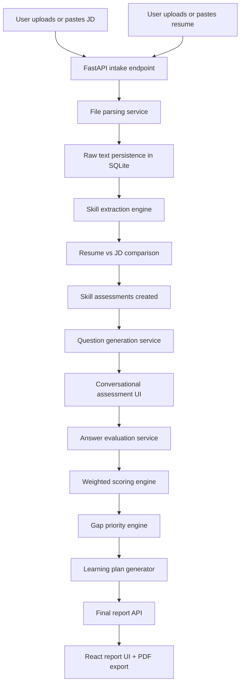

# Architecture Notes

## High-Level Flow

## Backend Modules

### `app/api`

- REST endpoints for intake, analysis, questions, answers, and report retrieval

### `app/services/file_parser.py`

- Parses `PDF`, `DOCX`, and `TXT`
- Supports manual text fallback

### `app/services/skill_extractor.py`

- Detects skills from a curated catalog
- Infers JD importance
- Infers resume strength from evidence snippets

### `app/services/llm_service.py`

- Default deterministic mock LLM behavior
- Optional OpenAI-backed implementation
- Replaceable question generation and answer evaluation boundary

### `app/services/assessment_engine.py`

- Session creation
- Gap analysis
- Question generation
- Answer scoring
- Learning plan generation
- Overall readiness computation

### `app/models/entities.py`

Main persisted entities:

- `JobDescription`
- `Resume`
- `AssessmentSession`
- `SkillAssessment`
- `Question`
- `Answer`
- `LearningPlanItem`

## Frontend Modules

### Pages

- `HomePage`
- `JobDescriptionPage`
- `ResumePage`
- `AnalysisPage`
- `AssessmentPage`
- `ReportPage`

### Client-side responsibilities

- Step-by-step workflow navigation
- Seed demo loading
- Assessment interaction
- Report visualisation
- PDF export

## Why This Architecture Works For A Hackathon Demo

- Fast to run locally with SQLite
- No authentication friction
- No cloud dependency required
- Seed data makes the demo reliable
- Mock LLM keeps the feature story intact even offline
- OpenAI integration is available later without rewriting the app
